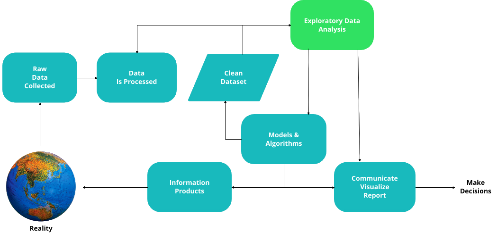
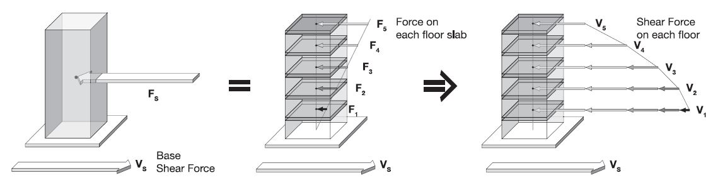

<h1 align="center" style="margin-top: 10px;margin-bottom:10px;text-decoration:underline">Data Science Project</h1>

  

# Understand building and land characteristics associated with earthquakes, by getting insights of data.

*A Practical Project undertaken by students at Kingston University for Group 5*

## Introduction

In 1970, a group of architects prepared seismic codes to prevent deaths that occur when buildings collapse (
Guevara-Perez, 2012). Their rigorous building regulations were hugely beneficial in 2011 when a magnitude 9 earthquake
hit the region, one of the largest earthquakes ever recorded. There are many factors that influence the strength of
earthquakes including the magnitude of earthquake, the site's proximity to the fault, the local geology, and the soil
type.

In this project, the field of **Data Science** uses scientific algorithms, methods, and processes to collect, refine and
represent the data in a way that it can describe patterns and observations related to building destruction due to
earthquakes. The obtained patterns and observations can be further analysed, and appropriate actions can be taken by
business or organizations to improve the quality of buildings and land (Dhar, 2013).

<h3 align="center" style="margin-top: 10px;margin-bottom:10px">Data Science Process</h3>

### Problem Statement

This study will address the possible factors behind the major destruction of buildings during the earthquake. The
information on earthquake events and quality of buildings are highly critical for an effective government. An effective
government could implement governance plans and reduce post-earthquake reconstruction. To support this problem statement
various research questions are formed and studied in this report.

### Proposed Approach

(Hoffinann and Schubert, 1994) confirms the compressibility measurements of concrete, and calcium
silicate (in N/mm2) which is used as Building Stone that proves to be a highly durable component in construction. (
Guevara-Perez, 2012) illustrates that the degree of irregularity in the configuration of a building is one of the most
important factors supporting the earthquake-resistant buildings. The dataset given for this project (explained later)
provides count of floors, ground floor type and other floor type attributes which indicate, according to the paper, a
soft-storey and weak-storey irregularity pattern may be explored from a given row of data (a building).

Lateral forces and shear forces generated in buildings due to ground motion,  
Source: (Guevara-Perez, 2012)

Recognizing the importance of: number of floors; component durability due to cement, mud and stone; roof type;
foundation type; and plan configuration (also attributes in the dataset), urges patterns to be revealed from this
dataset. Data sampling, Exploratory data analysis, data pre-processing, data visualization, and finding real-world
relationships between data attributes and damage grade will uncover seismic vulnerability to buildings.

## Dataset

